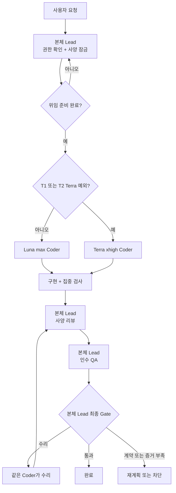

# Teamplay

[English](README.md) | [한국어](README.ko.md)

Teamplay은 현재 본체 Codex 에이전트가 제품 판단, 사양, 통합, 최종 코드
리뷰, 인수 QA, 최종 Gate를 직접 맡고, 사양이 잠긴 구현은 GPT-5.6 Luna
max에게 맡겨 코딩 비용을 절감하는 스킬입니다. Gate는 위임하지 않습니다.

```text
본체 Lead: 사양 -> 통합 -> 리뷰 -> QA -> Gate
Luna max: 구현 -> 집중 검사 -> 제한된 수리
```

핵심 정책은 단순합니다.

- 기본이자 최초 구현 Coder는 Luna max입니다.
- 어렵고 크고 모호하거나 deep, critical, 보안, 동시성 작업이라는 이유로
  더 강한 자식을 선택하지 않습니다.
- 본체 Lead가 중요한 결정을 먼저 해결하고 사양을 잠급니다.
- Terra xhigh는 가장 강한 Teamplay 자식이지만, 개별 T1/T2가 있는 진짜
  예외에만 사용합니다.
- Teamplay은 어떤 추론 수준에서도 Sol 자식을 만들지 않습니다.
- 최종 리뷰, 인수 QA, Gate는 모두 현재 본체 Lead가 직접 수행합니다.
  Gate 자식은 없습니다.

| 구현 경로 | 배정 정책 | 사용 조건 |
|---|---|---|
| Luna max | 모든 결과의 기본값. 90%는 사후 감사 하한선일 뿐 | 일반적인 모든 사양 잠금 구현 결과 |
| Terra xhigh | **배정 예산 0, 예약 비율 없음** | 개별 승인된 T1 또는 T2 예외만 |
| Sol | **배정 0** | 모든 Teamplay 자식에서 금지 |

Luna 90%는 목표 비율이 아닙니다. Terra 10%를 채우거나 모델을 다양화하려고
Terra를 만들면 안 됩니다. T1/T2가 없다면 그 실행의 구현 결과는 100%
Luna입니다. 관측 이력에서 Luna가 90% 아래라면 Terra 몫을 늘리는 대신
예외 판정이 너무 넓었는지 감사합니다.

## 한눈에 보기

| 단계 | 담당 | 모델 정책 | 결정적 결과 |
|---|---|---|---|
| 권한과 사양 | 본체 Lead | 현재 본체 세션 유지 | 잠긴 요구사항과 인수 조건 |
| 구현 | Coder | 기본 Luna max | 통합 가능한 완성 결과 |
| 예외 구현 | Coder | T1/T2가 있을 때만 Terra xhigh | 동일하게 잠긴 전체 결과 |
| 집중 검사와 수리 | 같은 Coder | 기존 경로와 세션 유지 | diff와 보조 증거 |
| 사양 리뷰 | 본체 Lead | 현재 본체 세션 유지 | 요구사항별 판정 |
| 인수 QA | 본체 Lead | 현재 본체 세션 유지 | 실제 시나리오 증거 |
| 최종 Gate | 본체 Lead | 현재 본체 세션 유지 | 완료, 수리, 재계획, 차단 |



Sol은 Teamplay이 선택할 수 없으므로 흐름에 나타나지 않습니다.

## 왜 Luna를 먼저 쓰나

Teamplay은 일반적인 “가장 똑똑한 모델 선택기”가 아닙니다. 이미 제품
문맥을 가진 본체가 결정과 품질 관리를 계속 맡고, 구현 처리량은 더 저렴한
Luna로 확보하는 것이 목적입니다.

2026-08-03에 확인한 공식 가격이며, Sol을 100% 기준으로 비교했습니다.

| 모델 | API 1M 입력 / 캐시 입력 / 출력 토큰 | Codex 1M 입력 / 캐시 입력 / 출력 크레딧 | Sol 대비 비용 | Sol 대비 토큰당 절감 |
|---|---:|---:|---:|---:|
| Sol | $5 / $0.50 / $30 | 125 / 12.5 / 750 | 100% | 0% |
| Terra | $2.50 / $0.25 / $15 | 62.5 / 6.25 / 375 | 50% | 50% |
| Luna | $1 / $0.10 / $6 | 25 / 2.5 / 150 | 20% | 80% |

가격은 바뀔 수 있습니다. 현재 비용을 말할 때는 공식
[모델 비교](https://developers.openai.com/api/docs/models/compare)와
[Codex 요금표](https://help.openai.com/en/articles/20001106-codex-rate-card)를
다시 확인해야 합니다. 라우팅 정책은 비용 관계를 사용하며 특정 가격을
영구 상수로 박지 않습니다.

Luna도 항상 max 추론을 사용합니다. 추론을 약하게 해서 절약하는 것이 아니라
모델 선택, 넓은 결과 단위, 같은 세션 재사용으로 절약합니다.

### 전부 Sol로 구현했을 때와 비교한 예상 절감

Luna, Terra, Sol은 입력, 캐시 입력, 출력 가격 비율이 동일하므로 자식 구현의
토큰 정규화 추정은 다음과 같습니다.

```text
Sol 대비 자식 비용 = 20% × Luna 토큰 비중 + 50% × Terra 토큰 비중
Sol 대비 자식 절감 = 100% - Sol 대비 자식 비용
```

| 계산 예시 | 전부 Sol 대비 자식 비용 | 예상 자식 절감 |
|---|---:|---:|
| Luna 100%, Terra 예외 없음 | 20% | **80%** |
| Luna 95% / Terra 5% | 21.5% | **78.5%** |
| Luna 90% / Terra 10% | 23% | **77%** |

5%와 10%는 계산 예시이지 Terra 할당량이 아닙니다. Terra의 배정 예산은
여전히 0이며, 각각의 Terra 결과에는 독립적인 T1/T2 승인이 필요합니다.

전체 워크플로 절감률은 더 낮습니다. 본체 Lead의 사양, 리뷰, QA, Gate 비용은
그대로이기 때문입니다. 전부 Sol로 가정한 전체 비용에서 자식 구현이 차지하는
비중별 예상은 다음과 같습니다.

| 기준 전체 비용 중 자식 구현 비중 | 자식 80% 절감 시 전체 절감 | 자식 77% 절감 시 전체 절감 |
|---|---:|---:|
| 50% | 40% | 38.5% |
| 70% | 56% | 53.9% |
| 80% | 64% | 61.6% |

이는 청구 금액이 아니라 가정에 따른 추정입니다. 실제 절감은 관측된 입력,
캐시 입력, 출력 토큰, 추론과 재시도, 문맥 재사용, 본체 직접 구현 비중, Fast
할증에 따라 달라집니다. 실제 결과는 호스트 사용량과 별도로 확인한 청구
표면을 기준으로 계산해야 합니다.

## 모델 정책

### 기본: Luna max

본체 Lead가 요구사항, 중요한 결정, 인터페이스, 소유권, 인수 조건을 잠근 뒤
Luna max가 완전한 구현 결과를 맡습니다. 파일 수는 모델 신호가 아닙니다.
하나의 Luna 결과에는 직접 필요한 코드, 테스트, fixture, 문서, 설정이 모두
포함될 수 있습니다.

아키텍처, 동시성, 마이그레이션, 보안, 생명주기, 제품 결정이 남았다면 먼저
본체 Lead가 해결합니다. Full Spec Lock이 필요할 수 있지만 최초 Terra나 Sol
Coder를 허용하지는 않습니다.

### 예외 상한: Terra xhigh

Terra xhigh는 다음 중 하나가 있을 때만 사용할 수 있습니다.

- `T1 explicit_user_terra`: 사용자가 Terra 구현 자식을 직접 요청함
- `T2 evidenced_luna_capability_blocker`: Luna가 동일하게 잠긴 전체 결과를
  실제로 시도했고, 사양 설명이나 같은 Luna 수리로 경제적으로 해결할 수
  없다는 구체적인 요구사항/검사 증거를 반환함

hard, deep, critical이라는 표현은 T1이 아닙니다. 느린 추론, 침묵, 파일 변경
없음, 일반적인 테스트 실패, 리뷰 결함 하나는 T2가 아닙니다. 멈춘 Luna는
모델을 올리지 않고 제한된 복구 뒤 본체 Lead가 인계합니다.

### Sol: 사용 불가

Teamplay은 구현, 리뷰, QA, 복구 경로, 어떤 preset에서도 Sol 자식을 선택하지
않습니다. Sol 자식 요청은 거절하며 Terra xhigh가 허용 가능한 최대 자식
경로입니다. 최종 Gate는 모델 라우팅 대상이 아니라 본체가 직접 수행합니다.

### 자주 발생하는 판단

| 상황 | Teamplay 동작 |
|---|---|
| 일반적이거나 넓은 구현 | 사양 잠금 후 Luna max |
| 어려움, 모호함, 보안, 동시성, 마이그레이션 | 본체가 결정을 해결하고 사양을 강화한 뒤 Luna max |
| 사용자가 Terra를 직접 요청 | T1 기록 후 Terra xhigh 한 명 |
| Luna가 구체적인 역량 한계를 반환 | 완전한 T2 증거를 기록한 뒤에만 Terra 검토 |
| Luna가 침묵하거나 멈춤 | 대기, 같은 세션 1회 redirect, 본체 Lead 인계 |
| 사용자가 Sol 자식을 요청 | 거절. Sol 사용 불가 |
| Critical 결과 | Luna max 구현, 본체가 리뷰·QA·최종 Gate 수행 |

Terra에는 배정 예산이 없습니다. “10% 미만이니 하나 써도 된다”는 식으로
해석하면 안 되며 모든 Terra는 개별 T1/T2로 설명해야 합니다.

## 빠른 시작

```bash
git clone https://github.com/youngchangjo/teamplay.git
cd teamplay
./scripts/install.sh
```

설치 후 Codex를 재시작하거나 새 작업을 열어 사용자 에이전트 등록을
갱신합니다.

```text
$teamplay 잠긴 내보내기 사양을 구현해줘.
$teamplay-fast 독립적인 두 결과를 Fast Luna 자식으로 구현해줘.
$teamplay-deep 이 마이그레이션을 더 강한 사양과 QA 계획으로 구현해줘.
$teamplay-critical 잠긴 위협 모델에 따라 이 인증 변경을 구현해줘.
```

네 preset 모두 Luna max에서 시작합니다. Deep과 Critical은 사양과 증거를
강화할 뿐 Terra나 Sol을 자동 선택하지 않습니다.

## 본체 Lead가 하는 일

현재 본체 대화 에이전트가 항상 Teamplay Lead입니다.

1. 저장소 지침, `CHANGELOG.md`, 코드, 검증 표면을 읽습니다.
2. 권한을 확인하고 Spec Brief 또는 Full Spec Lock을 잠급니다.
3. 위임 전에 중요한 결정을 해결합니다.
4. 기본 Luna max와 가장 작은 안전한 writer pool을 선택합니다.
5. 실제 diff를 통합하고 검사합니다.
6. 작성된 사양을 기준으로 모든 요구사항을 리뷰합니다.
7. 엔지니어링 무결성과 회귀 위험을 리뷰합니다.
8. 인수 QA를 직접 실행하거나 결정적 장면을 직접 관찰합니다.
9. 사양, QA, 위험, rollback, 증거를 기준으로 최종 Gate를 수행합니다.
10. 증거, 한계, 외부/출시 상태를 분리해 보고합니다.

자식은 자신의 구현을 승인하거나 최종 완료/Gate 판정을 내릴 수 없습니다.

## 왜 본체가 리뷰·QA·Gate를 하나

이 분리는 의도적입니다. 구현 자식은 잠긴 결과를 만드는 데 최적화되고,
본체 Lead만 전체 권한과 증거 문맥을 가진 채 결과를 판단할 수 있습니다.

| 본체가 맡아야 하는 이유 | 방지되는 실패 |
|---|---|
| 사용자 대화와 잠긴 사양의 원본 문맥을 보유 | 코드만 보고 요청 제품을 조용히 재정의하는 리뷰 |
| 위임한 구현 diff를 작성하지 않음 | Coder가 자신의 작업을 합리화하고 승인하는 문제 |
| 모든 결과와 공유 표면, 통합 변경을 함께 봄 | 국소적으로 맞는 코드가 전체 회귀나 소유권 충돌을 일으키는 문제 |
| 요구사항 체크리스트와 충실한 QA 표면을 통제 | lint/unit test를 브라우저·Simulator·기기·배포·출시 증거로 오인 |
| 정적·런타임·외부·출시 증거를 분리 | 서로 다른 증거를 섞어 근거 없이 완료 선언 |
| 사용자 권한과 완료 책임을 유지 | 자식이 승인되지 않은 제품·파괴·외부·출시 결정을 내리는 문제 |

Coder가 멈춰 본체가 직접 코드를 작성한 경우에도 기존 사양 체크리스트를
다시 열고 리뷰, QA, Gate를 별도 증거 단계로 수행합니다. 작성자가 곧
승인자가 되는 것은 아닙니다.

## Preset

| 명령 | 동작 |
|---|---|
| `$teamplay` | 기본 Luna max Standard, 기본 writer 한 명 |
| `$teamplay-fast` | Luna max에만 Fast 적용, 본체는 변경 없음 |
| `$teamplay-deep` | Luna max와 더 강한 invariant·rollback·증거 |
| `$teamplay-critical` | Luna max와 위협·복구 경계, 본체가 Critical Gate 수행 |

Fast는 Luna 자식에만 선택적으로 적용됩니다.

```toml
service_tier = "fast"

[features]
fast_mode = true
```

Fast는 속도와 소비량만 바꾸며 추론, 사양, 리뷰, QA는 바꾸지 않습니다.
공식 안내상 Fast는 더 많은 크레딧을 소비할 수 있으므로 명시적으로만
선택합니다.

## Luna Coder 수

| Writer 수 | 규칙 |
|---:|---|
| 1 | 기본값. 공유 변경도 한 명이 소유 |
| 2 | 계약과 검사가 독립적인 완전한 결과에만 자동 선택 |
| 3 | 사용자 명시 요청과 분리된 소유권 또는 독립 worktree 필요 |

한 wave에서 네 번째 mutating Coder는 금지합니다. 여러 Coder는 처리량 옵션일
뿐 하나의 기능을 파일, 컴포넌트, 명령, 정확한 수정으로 잘게 쪼개는 수단이
아닙니다.

## 하나의 결과, 하나의 Coder 세션

하나의 결과에는 직접 결합된 구현, 테스트, fixture, 문서, 설정이 포함됩니다.
세션 키가 같으면 같은 Coder가 구현, 집중 검사, Lead 피드백, 제한된 수리를
계속 맡습니다.

최초 할당에는 canonical execution capsule이 한 번 포함됩니다. 후속 지시는
같은 세션에 delta만 보내며 capsule이나 전체 작업을 다시 보내지 않습니다.

멈춘 Coder의 복구 흐름:

```text
이름 있는 제한 대기
-> 실제 diff와 에이전트 상태 검사
-> 같은 에이전트에 1회 redirect
-> CODER_STALLED
-> 자식 쓰기 중지
-> 본체 Lead가 동일한 전체 결과 인계
```

stall 복구는 Terra나 Sol을 만들지 않고 결과를 미세 분할하지도 않습니다.
본체 인계 후에도 리뷰, QA, Gate는 별도 단계입니다.

## 사양과 할당

하나의 제한된 결과에는
[spec-brief.md](skills/teamplay/templates/spec-brief.md)를 사용합니다. 병렬
소유권, 중요한 공유 계약, 마이그레이션/복구, Critical 증거가 필요한 경우
[spec-contract.md](skills/teamplay/templates/spec-contract.md)로 Full Spec Lock을
만듭니다.

공유 자식 정책은
[execution-policy.md](skills/teamplay/references/execution-policy.md)에 한 번만
있습니다. 본체 Lead가 task capsule과 함께 렌더링합니다.

```bash
python3 skills/teamplay/scripts/render-task-packet.py \
  --policy skills/teamplay/references/execution-policy.md \
  --task <task-capsule.md>
```

## 리뷰·QA·Gate·수리

본체 Lead는 실제 결과에서 다음을 수행합니다.

1. 요구사항별 사양 일치 리뷰
2. 정확성, 회귀, 보안, 개인정보, 동시성, 호환성, 유지보수성, 테스트 리뷰
3. 가장 충실한 표면에서 요구사항 기반 인수 QA
4. 요구사항 커버리지, 증거 계층, 잔여 위험, rollback, 외부 상태, 완료 주장에
   대한 최종 Gate

리뷰와 QA는 최대 두 번의 사양 내 수리 슬롯을 공유합니다. 같은 요구사항이
반복 실패하거나 잠긴 경계가 바뀌면 재계획합니다. 자식 테스트와 자문 보고는
보조 증거일 뿐이며 Gate 자식은 없습니다.

## 설치되는 역할

| 역할 | 설정 | 목적 |
|---|---|---|
| 현재 본체 Lead | 기존 세션 유지 | 사양, 통합, 최종 리뷰, QA, Gate, 완료 |
| `teamplay-coder` | Luna max | 기본 구현 소유자 |
| `teamplay-coder-fast` | Luna max + Fast | 선택적 고속 구현 소유자 |
| `teamplay-coder-deep` | Terra xhigh | T1/T2 예외 구현 소유자 |
| `teamplay-scout` | Luna max, 읽기 전용 | 제한된 저장소 탐색 |
| `teamplay-researcher` | Terra medium, 읽기 전용 | 최신 1차 출처 확인 |
| `teamplay-plan-challenger` | Terra high, 읽기 전용 | 선택적 사양 모순 점검 |
| `teamplay-reviewer` | Terra high, 읽기 전용 | 선택적 자문 finding |
| `teamplay-qa` | Luna max | 선택적 증거 수집 |

설치되는 Teamplay 역할에는 Sol도 Gate도 없습니다.

## 검증

```bash
./scripts/validate.sh --bundle
./scripts/install.sh
./scripts/validate.sh --installed
```

검증기는 모든 역할을 파싱하고 Sol 자식을 거부하며, 모든 Luna max, Terra
xhigh 상한, Fast 전용 설정, 렌더링 hash, prompt pressure, 라우팅/생명주기
fixture, 영문/한글 README 핵심 계약, 설치본 byte 일치를 확인합니다.

설정된 모델은 의도만 증명합니다. 실제 런타임 모델은 호스트나 에이전트
레지스트리 증거가 필요하며, 없으면 `NOT_PROVEN`입니다.

## 권한

Teamplay 자체는 커밋, 푸시, 병합, 출시, 외부 쓰기, 구매, 계정/권한 변경,
파괴적 작업을 승인하지 않습니다.
