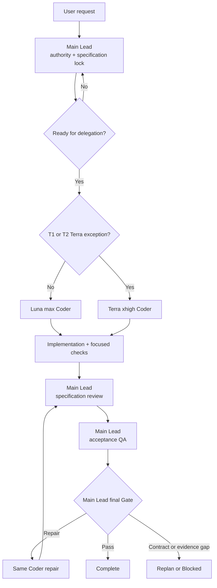

# Teamplay

Teamplay saves coding cost by assigning specification-locked implementation to
GPT-5.6 Luna at max reasoning while the current main Codex agent keeps product
judgment, integration, final code review, acceptance QA, and final Gate judgment.
Gate is not delegated.

```text
Main Lead: specification -> integration -> review -> QA -> Gate
Luna max: implementation -> focused checks -> bounded repair
```

The economic rule is deliberately simple:

- Luna max is the default and first implementation Coder.
- A task being hard, large, ambiguous, deep, critical, cross-cutting, or
  security-sensitive does not select a stronger child.
- The Lead resolves consequential decisions and locks the specification before
  delegation.
- Terra xhigh is the strongest Teamplay child and is an explicit or evidenced
  post-Luna exception only.
- Teamplay never creates a Sol child at any reasoning effort.
- Final review, acceptance QA, and Gate are all performed by the current main
  Lead. There is no Gate child.

| Implementation route | Allocation policy | When it is used |
|---|---|---|
| Luna max | Default for all outcomes; 90% is only a lower-bound audit alarm | Every normal specification-locked implementation outcome |
| Terra xhigh | **Allocation budget 0; no reserved percentage** | Only an individually authorized T1 or T2 exception |
| Sol | **Allocation 0** | Prohibited for every Teamplay child |

The 90% Luna figure is not a target mix. Teamplay must not create Terra to fill
10%, balance models, or make a report look diverse. If no T1 or T2 exception
exists, the run uses Luna max for 100% of its implementation outcomes. If an
observed history falls below the 90% Luna floor, the response is to audit overly
broad exceptions—not to allocate Terra a share.

## At a glance

| Phase | Owner | Model policy | Decisive output |
|---|---|---|---|
| Authority and specification | Main Lead | Existing main session unchanged | Locked requirements and acceptance |
| Implementation | Coder | Luna max by default | Complete integratable outcome |
| Exception implementation | Coder | Terra xhigh only with T1 or T2 | Same locked whole outcome |
| Focused checks and repair | Same Coder | Keep the existing route/session | Diff and supporting evidence |
| Specification review | Main Lead | Existing main session unchanged | Requirement verdicts |
| Acceptance QA | Main Lead | Existing main session unchanged | Observed scenario evidence |
| Final Gate | Main Lead | Existing main session unchanged | Complete, repair, replan, or blocked |



Sol does not appear in the flow because Teamplay cannot select a Sol child.

## Why Luna first

Teamplay is not a general “pick the smartest model” router. Its purpose is to
reuse the capable main conversation for decisions and quality control, then buy
implementation throughput at the cheaper Luna rate.

Official rates checked on 2026-08-03:

| Surface | Luna input / cached / output | Terra input / cached / output | Luna cost |
|---|---:|---:|---:|
| API, USD per 1M tokens | $1 / $0.10 / $6 | $2.50 / $0.25 / $15 | 1/2.5 of Terra |
| Codex, credits per 1M tokens | 25 / 2.5 / 150 | 62.5 / 6.25 / 375 | 1/2.5 of Terra |

Prices change. Recheck the official
[model comparison](https://developers.openai.com/api/docs/models/compare) and
[Codex rate card](https://help.openai.com/en/articles/20001106-codex-rate-card)
before making a current cost claim. The routing contract uses the cost-first
relationship, not hard-coded price values.

Luna still runs at max reasoning. Teamplay saves by model choice and session
reuse, not by lowering the implementation child's reasoning effort.

## Model policy

### Default: Luna max

After the Lead locks requirements, consequential decisions, interfaces,
ownership, and acceptance, Teamplay starts Luna max for the complete
implementation outcome. File count is irrelevant: one Luna may change every
directly required code, test, fixture, document, and configuration surface.

If the task initially contains unresolved architecture, concurrency, migration,
security, lifecycle, or product decisions, the Lead resolves them first. That
work may require a Full Spec Lock, but it does not authorize an initial Terra or
Sol Coder.

### Exception ceiling: Terra xhigh

Terra xhigh is allowed only when one record exists:

- `T1 explicit_user_terra`: the user directly requests a Terra implementation
  child.
- `T2 evidenced_luna_capability_blocker`: Luna already attempted the same locked
  whole outcome and returned concrete requirement/check evidence that
  clarification or same-Luna repair cannot resolve economically.

The words “hard,” “deep,” and “critical” do not satisfy T1. Slow reasoning,
silence, no file mutation, an ordinary failed test, or one review defect does
not satisfy T2. A stalled Luna transfers the unchanged outcome to the Lead after
the bounded recovery path; it does not escalate models.

### Sol: unavailable

Teamplay never selects GPT-5.6 Sol for implementation, review, QA, rescue, or
any preset. A request for a Sol child is rejected; Terra xhigh is the maximum
available child route. Final Gate is not routed at all—the main Lead performs it
directly. Teamplay also never changes the model or effort already selected for
that Lead.

### Common routing decisions

| Situation | Teamplay action |
|---|---|
| Ordinary or broad implementation | Lock the specification, then use Luna max |
| Hard, ambiguous, security, concurrency, or migration work | Lead resolves decisions and strengthens the spec, then uses Luna max |
| User explicitly requests Terra | Record T1 and use one Terra xhigh Coder |
| Luna returns a concrete capability blocker | Record complete T2 evidence before considering Terra xhigh |
| Luna is silent or stalls | Wait, redirect once, then Main Lead takeover |
| User requests a Sol child | Reject the route; Sol is unavailable |
| Critical outcome | Luna max implementation; Main Lead performs review, QA, and final Gate |

Terra should remain genuinely rare because it has no allocation budget. Teamplay
reports each T1/T2 exception individually and does not treat “under 10%” as
permission to create one.

## Quick start

```bash
git clone https://github.com/youngchangjo/teamplay.git
cd teamplay
./scripts/install.sh
```

Restart Codex or open a new task after installation so custom-agent
registration refreshes.

Then ask normally:

```text
$teamplay Implement this locked export specification.
$teamplay-fast Implement these two independent outcomes with Fast Luna children.
$teamplay-deep Implement this migration with a stronger specification and QA plan.
$teamplay-critical Implement this auth change under the locked threat model.
```

All four start from Luna max. Deep and Critical strengthen the specification and
evidence; they do not select Terra or Sol by name.

## What the Lead does

The current main conversation agent is always Teamplay Lead. It:

1. reads repository instructions, `CHANGELOG.md`, code, and validation surfaces;
2. confirms authority and locks a Spec Brief or Full Spec Lock;
3. resolves consequential decisions before delegation;
4. selects Luna max by default and the smallest safe writer pool;
5. integrates and inspects the actual diff;
6. reviews every requirement against the written specification;
7. performs an engineering-integrity review;
8. executes or directly observes acceptance QA;
9. directly performs the final Gate from the specification, QA, risk, rollback,
   and evidence record;
10. reports evidence, limitations, and external/release state separately.

Children cannot approve their own implementation or issue the final completion
or Gate verdict.

## Why the Main Lead reviews, runs QA, and performs Gate

The separation is intentional. The implementation child optimizes for producing
the locked outcome; the main Lead remains the only participant with the complete
authority and evidence context needed to judge it.

| Why the Main Lead owns it | Failure this prevents |
|---|---|
| It holds the canonical user conversation and locked specification | Reviewing only the code and silently redefining the requested product |
| It did not produce the delegated implementation diff | A Coder approving or rationalizing its own work |
| It sees every outcome, shared surface, and integration change | Locally correct code causing cross-slice regressions or ownership conflicts |
| It controls the requirement checklist and faithful QA surfaces | Treating lint/unit tests as proof of browser, Simulator, device, deployment, or release behavior |
| It separates static, runtime, external, and release evidence | Blending unlike proof layers into one unsupported “done” claim |
| It retains user authority and completion responsibility | A child making product, destructive, external, or release decisions it was never authorized to make |

Even after a stalled-Coder takeover causes the Lead to write code directly, the
Lead reopens the specification checklist and runs review, QA, and Gate as
separate evidence phases. Authorship never counts as approval.

## Presets

| Command | Behavior |
|---|---|
| `$teamplay` | Luna max Standard, one writer by default |
| `$teamplay-fast` | Luna max with child-local Fast; Lead unchanged |
| `$teamplay-deep` | Luna max with richer invariants, rollback, and evidence |
| `$teamplay-critical` | Luna max with threat and recovery boundaries; Main Lead performs the critical Gate |

Fast affects only eligible Luna children:

```toml
service_tier = "fast"

[features]
fast_mode = true
```

Fast changes speed and consumption, not reasoning, specification, review, or QA.
It is optional because official guidance notes that Fast consumes credits at a
higher rate.

## One or more Luna Coders

| Writers | Rule |
|---:|---|
| 1 | Default, including shared mutable work |
| 2 | Automatic only for complete independent outcomes with frozen contracts and independent checks |
| 3 | Explicit user request plus disjoint ownership or isolated worktrees |

Never use a fourth mutating Coder in one wave. Multiple Coders are a throughput
option, not a way to split one feature into files, components, shell commands,
or exact edits.

Every shared manifest, lockfile, generated output, or other mutable integration
surface has one owner or belongs to the Lead's serial integration step.

## One outcome, one Coder session

One outcome includes all directly coupled implementation, tests, fixtures,
documentation, and configuration. The same Coder identity stays with that
outcome through focused checks, Lead feedback, and bounded in-spec repairs while
the session key remains unchanged.

The initial assignment contains one canonical execution capsule. Continuations
reuse the same session with a compact delta packet and contain no capsule or full
task copy.

For a silent or non-mutating Coder:

```text
named bounded wait
-> inspect actual diff and agent state
-> one redirect to the same agent
-> CODER_STALLED
-> stop child mutation
-> Lead finishes the unchanged whole outcome
```

Stall recovery never creates a Terra or Sol Coder and never micro-splits the
outcome. After Lead takeover, the Lead reopens the locked requirement checklist
and still performs separate review and acceptance QA.

See
[session-continuity.md](skills/teamplay/references/session-continuity.md) for the
normative lifecycle contract.

## Specification and assignment

Use [spec-brief.md](skills/teamplay/templates/spec-brief.md) for one bounded
outcome. Use [spec-contract.md](skills/teamplay/templates/spec-contract.md) when
parallel ownership, consequential shared contracts, migration/recovery, or
critical evidence requires a Full Spec Lock.

Shared child policy lives once in
[execution-policy.md](skills/teamplay/references/execution-policy.md). The Lead
renders it with the task capsule:

```bash
python3 skills/teamplay/scripts/render-task-packet.py \
  --policy skills/teamplay/references/execution-policy.md \
  --task <task-capsule.md>
```

The renderer reports canonical capsule, task, and rendered-prompt SHA-256
values. Coder role prompts do not duplicate the global policy.

## Review, QA, Gate, and repair

The Lead performs these gates on the real artifact:

1. requirement-by-requirement specification conformance;
2. correctness, regression, security, privacy, concurrency, compatibility,
   maintainability, and meaningful-test review;
3. requirement-linked acceptance QA on the most faithful available surface;
4. final Gate over requirement coverage, evidence layers, residual risk,
   rollback boundaries, external state, and completion claims.

Review and QA share at most two in-spec repair slots. A repeated failure of the
same requirement, changed frozen boundary, or need for another repair returns to
replanning. Child tests and advisory reports are supporting evidence only. No
Gate child exists.

## Installed roles

| Role | Configuration | Purpose |
|---|---|---|
| Current main Lead | Existing session unchanged | Specification, integration, final review, QA, Gate, completion |
| `teamplay-coder` | Luna max | Default implementation owner |
| `teamplay-coder-fast` | Luna max + Fast | Optional accelerated implementation owner |
| `teamplay-coder-deep` | Terra xhigh | T1/T2 exception implementation owner |
| `teamplay-scout` | Luna max, read-only | Targeted repository discovery |
| `teamplay-researcher` | Terra medium, read-only | Current primary-source verification |
| `teamplay-plan-challenger` | Terra high, read-only | Optional pre-lock contradiction challenge |
| `teamplay-reviewer` | Terra high, read-only | Optional advisory findings |
| `teamplay-qa` | Luna max | Optional evidence collection |

No installed Teamplay role uses Sol, and no Gate role is installed.

## Validate

```bash
./scripts/validate.sh --bundle
./scripts/install.sh
./scripts/validate.sh --installed
```

Validation parses every role, rejects all Sol child models, verifies Luna max,
Terra xhigh ceilings, and Fast-only settings, renders representative assignments,
checks capsule hashes and prompt pressure, classifies routing/lifecycle fixtures,
and compares installed bytes.

Configured models prove intent only. Live runtime identity requires host or
agent-registry evidence; otherwise report `NOT_PROVEN`.

## Authority

Teamplay does not itself authorize commits, pushes, merges, releases, external
writes, purchases, account/permission changes, or destructive actions.
